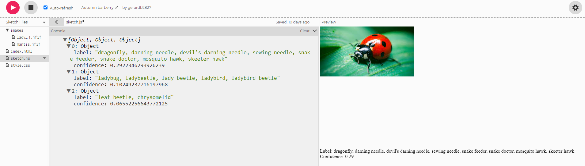

# Entry 3
##### 2/10/21

I've been working with ML5, and I've run into countless problems as I progressed. I recently moved from <a href="https://repl.it">_**repl.it**_</a> to <a href="https://github.com">_**Github.**_</a> I did this change because github's platform is more versatile, and free.
Soon after the switch I began to realize that ml5 does not work very well with github and my Ide. I’ve run into countless errors when trying to run the startup code in my Ide.
```javascript
 // Initialize the Image Classifier method with MobileNet
const classifier = ml5.imageClassifier('MobileNet', modelLoaded);
// When the model is loaded
function modelLoaded() {
  console.log('Model Loaded!');
}
// Make a prediction with a selected image
classifier.classify(document.getElementById(js/projects/me.jpg)), (err, results) => {
  console.log(results);
};
function setup() {
    createCanvas(400, 400);
}
function draw() {
    background(200);
 }
```
This code ran an error saying `TypeError: Cannot read property 'elt' of null`. I went through many websites to try, and see why I was getting this error. 
From what I understood it had something to do with ML5 not including a part in the cdn link provided in the Get Started section. Unfortunately, I don't remember the website I got the missing link from.
However, when I included that into my index file the error was still there. So I decide to stop working in my Ide and github, and moved to <a href= "https://editor.p5js.org/">_**p5.js Web Editor**_.</a> Ml5 was built to run very well with p5.js, which  is where the 5 in ml5 comes from.
P5.js is very different from what I'm used to working with, so I’m going to have to learn this tool while learning how to navigate p5.js. Luckily ml5 has a useful <a href = "https://editor.p5js.org/ml5/sketches/ImageClassification">_**link**_</a> for starter code when running in p5.js. 
I ran into a few problems with uploading images, but later learned that it has something to do with a crome extention I have on my comebook. Moving to another computer solved this problem and I was ready to work. This is the code that I have so far:
```javascript 
let classifier;
// A variable to hold the image we want to classify
let img;
function preload() {
  classifier = ml5.imageClassifier('MobileNet');
  img = loadImage('images/mantis.jfif');
}
function setup() {
  createCanvas(400, 400);
  classifier.classify(img, gotResult);
  image(img, 0, 0);
}
// A function to run when we get any errors and the results
function gotResult(error, results) {
  // Display error in the console
  if (error) {
    console.error(error);
  }
  // The results are in an array ordered by confidence.
  console.log(results);
  createDiv('Label: ' + results[0].label);
  createDiv('Confidence: ' + nf(results[0].confidence, 0, 2));
}
```
This code is bringing a pretrained image classifier model called _**Mobilenet**_ in the `preload function`, and giving an image to the model to define. The `setup function` is a set area for the image being classified, and puts it on the screen.
Finally the `gotResult function` is what Mobilenet thinks the image is. _**Mobilenet**_ order's the top 3 things it thinks the image is in confidence scores. This gets logged into the console as an array with a number assinged to it.
The function then takes the first guess which has the highest score and labels the image as that guess. It would look something like <a href ="https://editor.p5js.org/gerardb2827/present/2wK8TJO8u">this</a>. By going into the console you will be able to see the other things the model thought it was.
MobleNet however, doesn't always get the correct results. When shown a picture of a <a href = "https://editor.p5js.org/gerardb2827/present/mUx1bUh1o">ladybug</a> the highest confidence score it had was of a dragonfly with a confidence of 0.3. Interestingly enough the second highest score was a ladybug with a confidence score of 0.1. 
 


In the **Engineering Design Process** I’m on _Create a prototype_. I understand what I need to do and my next steps from there. I'm going to have to research how to add picture to a pretrained model, and train it. I'm going to use this modle as a base and build on it to make it my own. 
When I do figure out how to add on to a pretrained model I'm going to center it around common household bugs. That would be the most pratical use of the model, to help people identify whats in there house. My plan for training the model would be to first focus of one specific insect. From there I would have it work on that for a while, and make sure that its able to identify it at different angles.
To make sure it would have pictures it has never seen before I would ask some friends to take picture of any insects they have in there house. 

The **Skills** I worked on during this time are, _Embracing failure_ and _Problem decomposition_. I've been faced with so many problems as I have moved in this project, that _Embracing failure_ kind of just came to me. I was getting so many error codes, that I was basically making no progress. 
It took me time to realize that all these problems just happen when you code. You can't expect to get everything correct on the first try, and the only way to more forward and grow is through struggle. This isn't to say that I didn't’ feel discouraged at all when coding. It was very frustrating and still is to this day when I’m coding. However this is what happens when you are learning on your own. 
_Problem decomposition_ really helped me when going through all those failures. It helped me see that the problem I'm facing actually isn't as big as I was making it seem. Breaking it into smaller pieces made me see the problem from different angles. This was one of the reasons for why I switched to p5.js.
It helped me see that I could take another route to get different results, and solve the problem I was facing. Doing that allowed me to make more progress much faster than if I was to just stay on github facing that one big problem.

[Previous](entry02.md) | [Next](entry04.md)

[Home](../README.md)